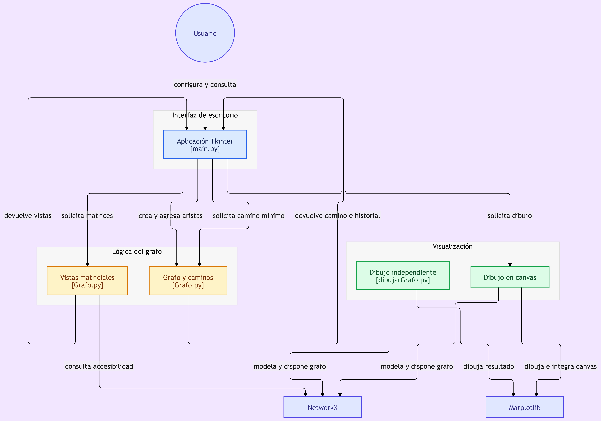

# Matemática Computacional 💻 - TB1


## 👥 Integrantes 

| Integrante | Aportes |
| ----------- | ------ |
| Cóndor Velásquez, Angela Bibiana | Redacción de la introducción y desarrollo del marco teórico, la teoría de grafos y su aplicación en problemas de caminos mínimos - Se desarrolló la formulación teórica para encontrar la trayectoria de menor costo entre un vértice de origen y uno de destino, incluyendo la representación y suma de los costos de las aristas, así como el fundamento y funcionamiento paso a paso del algoritmo de Dijkstra |
| Horna Cueva, Carlos Orlando Frank | Aplicaciones del proyecto - Diseño de la interfaz visual del programa - Implementación de la matriz de pesos, adyacencia y de caminos - Implementación del paso a paso del algoritmo de Dijkstra en la interfaz visual |
| Leon Ojeda, Adrian Alejandro | Creación de la clase Grafo con vértices, aristas y lista de adyacencia en el código fuente - Implementación del algoritmo de Dijkstra en Python dentro del código fuente - Graficación del Grafo con Matplotlib y NetworkX dentro del código fuente. |
| Quispe Laura, Johan Micael | Redacción de la introducción - Planteamiento del problema, explicación de la teoría de grafos y justificación del uso del algoritmo de Dijkstra |
| Sedano Barreda, Luis Enrique | Desarrollo del marco teórico - Formulación teórica de cómo encontrar el camino mínimo partiendo de un vértice de origen hasta un vértice de destino - Explicación de la suma de costos y el funcionamiento del algoritmo de Dijkstra |

## 📝 Caso del proyecto

**Caso 2: Problema del camino mínimo**

FastRoute es un programa computacional en Python que resuelve el problema del camino mínimo en un grafo ponderado, utilizando el algoritmo de Dijkstra.

El programa solicita al usuario que ingrese un número de vértices 𝑛, con _5 ≤ 𝑛 ≤ 15_, y ofrece 2 opciones para construir un grafo:

- Generación automática: crea aleatoriamente una matriz con pesos no negativos, representando las aristas del grafo.
- Ingreso manual: permite que el usuario introduzca las aristas del grafo, específicando el vértice 1, vértice 2 y el peso de la arista.

Una vez terminada la generación del grafo, el programa grafica los vértices y los nodos del grafo con sus pesos correspondientes. Asimismo, el programa genera la matriz de adyacencia binaria, la matriz de adyacencia ponderada y la matriz de caminos de tamaño 𝑛 × 𝑛 correspondientes al grafo.

Finalmente, el programa permite que usuario seleccione un vértice de origen y un vértice de destino, y el programa determina el camino mínimo entre ambos, indicando la secuencia de vértices que lo conforman, el costo total del recorrido y el desarrollo paso a paso del algoritmo de Dijkstra utilizado para obtener la solución.

## 🤔 ¿Cómo ejecutar el programa?

- Debe contar con todas las dependencias principales del proyecto, las cuales están detalladas en la parte de [requisitos](#-requisitos).
- Para instalar estas dependencias, se puede usar la terminal tal como se detalla en la parte de [instalación local](#instalación-local).
- Debe ejecutarse el archivo [main](main.py) en un entorno con Python >= 3.11, y se podrá utilizar la aplicación correctamente.

## 📃 Ensayo escrito

<https://docs.google.com/document/d/1fkgKkOlmoDAklxEF-dcQPGk53CMKxI-PJQ0BN2SKPco/edit?usp=sharing>

## 🗂️ Estructura del proyecto

### Estructura de archivos

```text
└── aleon30-matematica-computacional/
    ├── .gitignore             # Archivos ignorados por Git (pycache y .vscode)
    ├── Grafo.py               # Implementación de la clase Grafo
    ├── README.md              # Resumen del proyecto y documentación
    ├── dibujarGrafo.py        # Visualización del grafo
    ├── main.py                # Ejecutable principal
    ├── requirements.txt       # Dependencias del proyecto
    └── assets/ 
        ├── diagrama_flujo.png   # Diagrama de flujo del proyecto
        └── logo.png             # Logo del proyecto
```

### Diagrama de flujo



## 🔧 Requisitos

Este proyecto está desarrollado para ejecutarse localmente con:

- Python 3.11

### Dependencias principales

| Librería | Versión recomendada | Uso dentro del proyecto |
| --- | --- | --- |
| `networkx` | `>= 3.4.2` | Modelización del grafo |
| `matplotlib` | `>= 3.10.0` | Visualización del grafo |

### Instalación local

Puedes instalar las dependencias usando el archivo `requirements.txt` con el siguiente comando en la terminal:

```bash
pip install -r requirements.txt
```